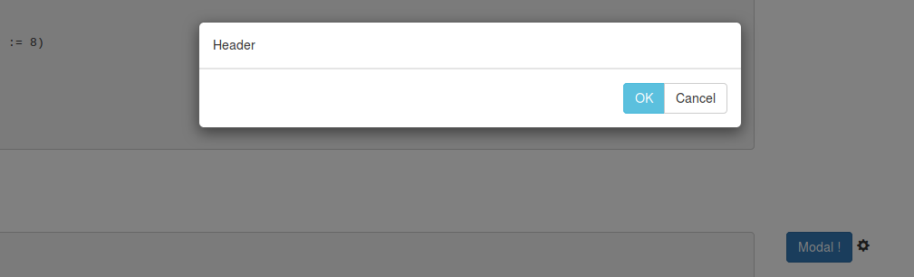
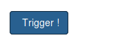

scaladget
=========

Scaladget provides a scala facades of some famous javascript libraries. It relies on the [scala-js](http://www.scala-js.org/) project. Among them:
* [Bootstrap-native.js](https://thednp.github.io/bootstrap.native/)
* [Sortable.js](http://rubaxa.github.io/Sortable/)
* [Ace Editor](http://ace.c9.io)
* [Bootstrap-slider](http://seiyria.com/bootstrap-slider/)
* [Lunr](https://lunrjs.com/)


## Usage ##
Just add this to your dependencies:
```sh
  libraryDependencies += "fr.iscpif.scaladget" %%% "bootstrapnative" % scaladgetVersion
  libraryDependencies += "fr.iscpif.scaladget" %%% "ace" % scaladgetVersion
  libraryDependencies += "fr.iscpif.scaladget" %%% "bootstrapslider" % scaladgetVersion
  libraryDependencies += "fr.iscpif.scaladget" %%% "lunr" % scaladgetVersion
```

Current version : **1.0.1**

All the facades are intensively used in the [OpenMOLE project](https://github.com/openmole/openmole).

## Bootstrap-native library ##
[Demo](http://zebulon.iscpif.fr/~leclaire/scaladget/)

The boostrap-native facade (based on [https://thednp.github.io/bootstrap.native/](http://zebulon.iscpif.fr/~leclaire/scaladget/)) renders transparent the use of buttons, forms, modals, tables, collapsers, selectors etc...

Imports:
```scala
import scaladget.bootstrapnative.bsn._
```

Here is an example of bootstrap modal dialog creation in full scala:
```scala   
    import scalatags.JsDom.tags
    
    // Create the Modal dialog
    val modalDialog: ModalDialog =
      ModalDialog(
        onopen = ()=> println("OPEN"),
        onclose = ()=> println("CLOSE")
      )

    // Append header, body, footer elements
    modalDialog header div("Header")
    modalDialog footer buttonGroup()(
      ModalDialog.closeButton(modalDialog, btn_info, "OK"),
      ModalDialog.closeButton(modalDialog, btn_default, "Cancel")
    )

    // Build the dialog and the modal dialog
    tags.span(
      modalDialog.dialog,
      button("Modal !", onclick := {() => modalDialog.show}, btn_primary, marginLeft := 5),
      tags.span(glyph_settings, paddingLeft := 5, pointer, onclick := {()=> modalDialog.show})
```


And here an example for a dynamic collapser:

```scala
buttonIcon("Trigger !", btn_primary).expandOnclick(panel("My text in detail")(width := 400))
```



Find more examples on the: [API Demo](http://zebulon.iscpif.fr/~leclaire/scaladget/)
Here is an example of scaladget intensive use in the [OpenMOLE project](https://github.com/openmole/openmole/blob/master/openmole/gui/client/org.openmole.gui.client.core/src/main/scala/org/openmole/gui/client/core/ScriptClient.scala)

## Bootstrap-slider library ##
See rendering in the [API Demo](http://zebulon.iscpif.fr/~leclaire/scaladget/)


## SVG rendering ##
A SVG API for rendering typed path in SVG is provided. it is compatible with [scalatags](https://github.com/lihaoyi/scalatags).
See a simple example [here](http://zebulon.iscpif.fr/~leclaire/scaladget/svg.html)


An example using the scaladget SVG tool and reactive library [scala.rx](https://github.com/lihaoyi/scala.rx) can be found in this [demo](http://zebulon.iscpif.fr/~leclaire/scaladget/flowchart.html). 
It reproduces this [D3 flowchart](http://bl.ocks.org/cjrd/6863459).


